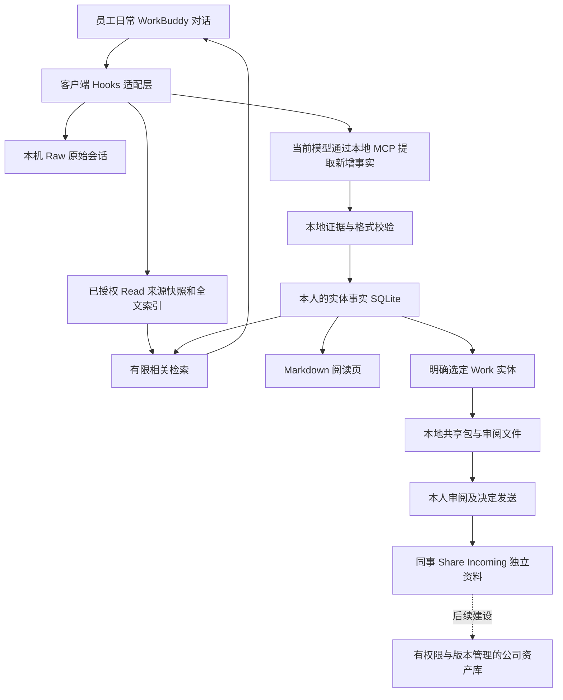

# 公司长期知识资产：架构与建设边界

2026-09-17。区分“当前已实现”与“后续设计”，不以设计代替验收。

## 核心原则

每人先沉淀自己的东西，后续挑选工作资产给其他 KA 使用。Personal/Work 是内容归类；可见范围、资产归属和发布权限是另外三件事。Work 不自动等于全公司可见，Personal 也可能含在工作原文里。因此不能把十个文件夹简单合并。

实线是现有能力或明确的人工步骤；虚线未实现。原始会话、结构化事实和阅读页都在本机，当前云端模型可处理授权范围内文本；不是完全离线。

## 为何资料不会完全绑死在某个客户端

当前已补充 UTF-8 JSONL 导出、版本 manifest、实体/事实 ID、来源、时间、事实类型、文件哈希和恢复验证；同时保留通用 Markdown 和原始文件。SQLite 是本机事实源，FTS 是可重建检索结构。备份不依赖平台 token 或账号。

换客户端时可保留这些数据，重新做“对话采集、检索注入、Memory Writer 调用”适配。**目前只有 WorkBuddy 适配器**；不能声称装上 Codex、DeepSeek 网页或任意客户端就会继续自动沉淀。原始 transcript 格式仍与宿主有关，JSONL 事实是已做的中立层，完整消息中立格式/附件映射尚需补充。

模型升级只能改变提取器，不应自动全量改写历史。对新旧模型跑同一套虚构业务案例，比较漏记、错记、推测误当事实、同名合并、报价失效和召回边界，再开放新模型写入。历史数据批量重提取应在副本中进行，保留旧版本及审批，不能后台悄悄“优化”公司资产。

## 长期公司版应补充的数据模型（尚未全部实现）

| 对象 | 当前 | 公司版所需 |
|---|---|---|
| 实体 | 类别、名字、别名、本地确定性 ID | 公司稳定 ID、CRM ID、跨贡献者映射和同名拆分 |
| 事实 | 正文、类型、沉淀日期、session、摘录、关系 | 业务生效/失效时间、审核状态、替代关系、版本 |
| 来源 | Raw session、内容寻址 source ID、已读文本哈希、文件事实出处 | 邮件 Message-ID、附件映射、文件页码/段落 |
| 所有权 | 本地 owner UUID | 员工/部门身份、资产归属、交接责任人 |
| 权限 | 本机个人库、手工选定分享 | 指定员工/项目组可见、发布审批、访问审计 |
| 邮件 | 聊天提及的事实、手工文件可备份 | 已授权只读采集、线程去重、附件与原件定位、收发状态 |
| 历史与删除 | 原文、部分快照、冲突保留 | 生命周期、保留政策、合法删除、备份到期与共享撤销流程 |

现有 ID 基于类别/领域/名称，不能冒充全球唯一客户 ID。多个 KA 的同名联系人、同一家客户的不同合同和不同时间报价必须可并存，不能按名字直接覆盖。

## 邮件怎样沉淀，怎样分享

“草稿”“已提交发送”“对方回复”“对方确认”必须分别记；AI 写出的邮件草稿不能变成客户答复或成交事实。报价至少关联客户、产品/范围、币种、税费、数量、有效期、版本和审批状态；缺项应明确缺失。实际发件、接单、合同审批仍按公司流程。

建议后续采用两层：

1. 私有/授权源档案：原始 `.eml`、Message-ID、线程关系、收发时间/时区、附件哈希、邮箱来源和访问范围。原始收件人、抄送、签名、隐藏引用链不默认分享。
2. 可发布工作资产：经过选择和审核的客户背景、谈判结论、模板、技术答复、踩坑经验；附可核验的来源引用和版本。必要邮件原文单独授权，不能把整个线程顺手带走。

当前 work-share 已移除 Raw 和原文摘录，但事实正文/关系仍可能含私人或敏感资料，故审阅步骤不可省。单条事实勾选、邮件片段脱敏与预览、附件权限、邮箱自动采集尚未实现。`.eml` 被备份不代表邮件已被解析或索引。

## 日常便利性目标

正常聊天自动沉淀；仅在失败、冲突、需分享或重要业务确认时打扰。团队版应有很小的状态入口：最近一次保存、待处理数、错误、备份时间；管理员只看健康元数据，不能顺手读取个人正文。

员工分享应能“选客户/项目 → 勾选事实或邮件 → 看预览 → 指定人 → 发布”。同事询问时按权限检索，显示贡献者、时间、适用范围及是否过期。这是目标流程；当前只有本地 CLI 导入导出，不能称为开箱即用的协作体验。

## 备份、换电脑与离职

- 每人库与正式公司资产库分开备份。至少有一个不受日常 AI 写权限控制的加密副本；恢复演练比“已有备份文件”更重要。
- 同事换电脑迁移私有包；公司交接导出经审核的工作包，不能要求交出 Personal 和全部聊天。
- 离职前确定待交接客户/项目及授权邮件，逐项验收公司副本，再按公司政策处理账号与设备；撤销账户访问不等于已分发文件消失。
- 存储量增长要按 Raw、附件、事实、快照、导出包分别统计。当前没有自动归档策略，不应假设 SQLite/Markdown 永远不用维护。
- 离线使用可读本地资料，但当前云端 Memory Writer 不可用时不会自动完成提取；待处理必须显式可见。

## 发布顺序与不可跳过的门槛

1. Mac 隔离与桌面验收：备份后升级，提供具体版本和测试证据。
2. 一台真实 Windows：安装、权限重启、并发、路径、断网恢复、迁移、手工冲突、杀进程/磁盘容量测试。
3. 两名 KA 受控试点：各自独立库，手工审核共享；记录遗漏和额外耗时，先不接整个邮箱。
4. 再做公司共享入口与邮件来源模型：明确权限和公司主数据负责人，建立审核/纠错/交接流程。
5. 完成独立备份与恢复演练、故障响应责任、版本回归后，才扩大到十人。

本地插件可以作为基础；当前还不应成为唯一公司档案，也不应替代正式合同、报价单、邮件原件和 CRM。不能保证永不出问题，能做的是有证据、能发现失败、能恢复、能迁走，并明确谁负责修正。
